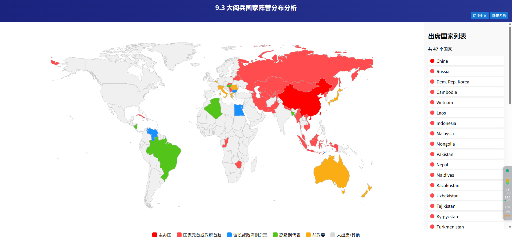
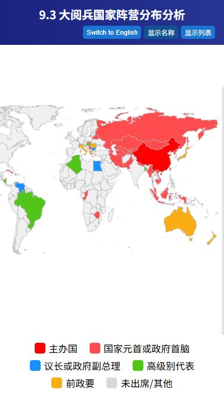

# 9.3 大阅兵 - 国际阵营情况（按出席人员等级着色）

根据国家领导人出席情况，在世界地图上按**出席人员等级**对国家进行着色，并在右侧显示国家列表与统计。

> 注意：本项目是 **2D ECharts 地图（map / geo）**，颜色表示的是“出席级别/人员等级”，而不是政治阵营或外交关系。

## 在线预览

项目地址：[https://xyy277.github.io/map93/](https://xyy277.github.io/map93/)



---

## 功能特点

- 世界地图 **全屏展示（响应式）**  
- **按出席人员等级着色**（颜色含义见下方图例）  
- 鼠标悬停显示 国家中文 / 英文（tooltip）  
- 右侧面板显示国家列表（手机端可滑出/隐藏）  
- 支持 **中文/英文切换** 与 **地图名称显示/隐藏** 开关  
- 支持 GitHub Pages / 本地静态服务器部署

---

## 出席人员等级 & 颜色说明（图例）

下面是当前代码中使用的等级与颜色映射（与你代码中的 `colorMap` 保持一致）：

- <span style="display:inline-block;width:14px;height:14px;background:#ff0000;border-radius:2px;margin-right:8px;"></span> **主办国**（value = 0） — `#ff0000`（大红）  
- <span style="display:inline-block;width:14px;height:14px;background:#ff4d4f;border-radius:2px;margin-right:8px;"></span> **国家元首 / 政府首脑出席**（value = 1） — `#ff4d4f`（红）  
- <span style="display:inline-block;width:14px;height:14px;background:#1890ff;border-radius:2px;margin-right:8px;"></span> **议长 / 政府副总理出席**（value = 2） — `#1890ff`（蓝）  
- <span style="display:inline-block;width:14px;height:14px;background:#52c41a;border-radius:2px;margin-right:8px;"></span> **高级别代表出席**（value = 3） — `#52c41a`（绿）  
- <span style="display:inline-block;width:14px;height:14px;background:#faad14;border-radius:2px;margin-right:8px;"></span> **前政要出席**（value = 4） — `#faad14`（橙）  
- <span style="display:inline-block;width:14px;height:14px;background:#d9d9d9;border-radius:2px;margin-right:8px;"></span> **未出席 / 其他** — `#d9d9d9`（灰）

> 说明：颜色由页面脚本中 `colorMap` 生成。如果你想调整颜色，请编辑 HTML 中对应的 `colorMap` 定义（见下方“如何修改颜色/等级”）。

---



---

## 部署方式（快速）

1. 确保仓库包含页面文件（`index.html`）以及依赖资源：
   - `./asset/geo/world.json`（或 `./asset/geo/map.json`）—— GeoJSON 世界地图
2. 本地预览（推荐使用静态服务器以避免 CORS）：
   ```bash
   python -m http.server 8080
